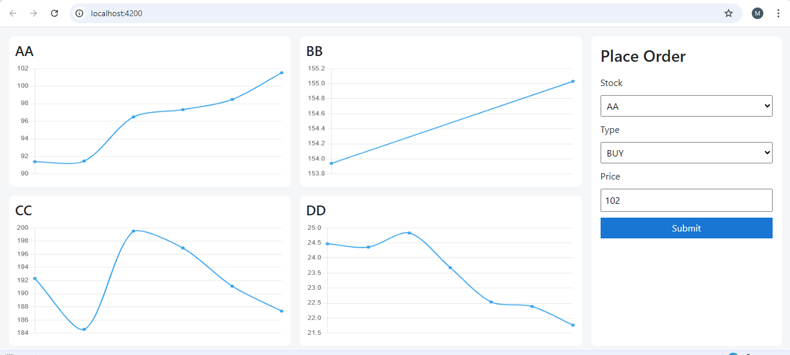
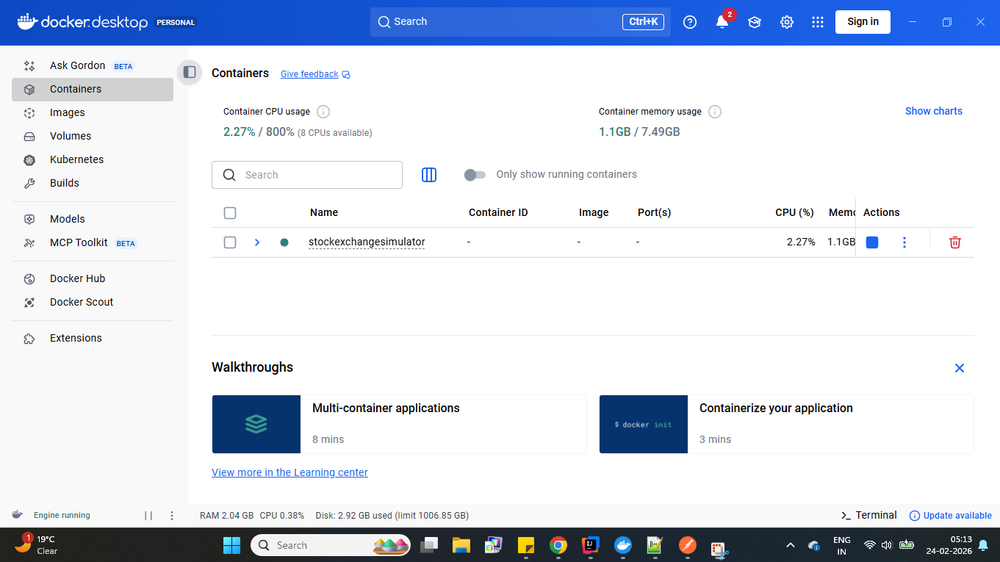
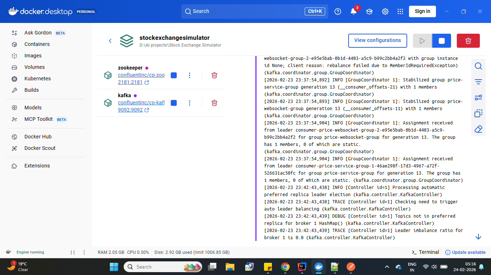
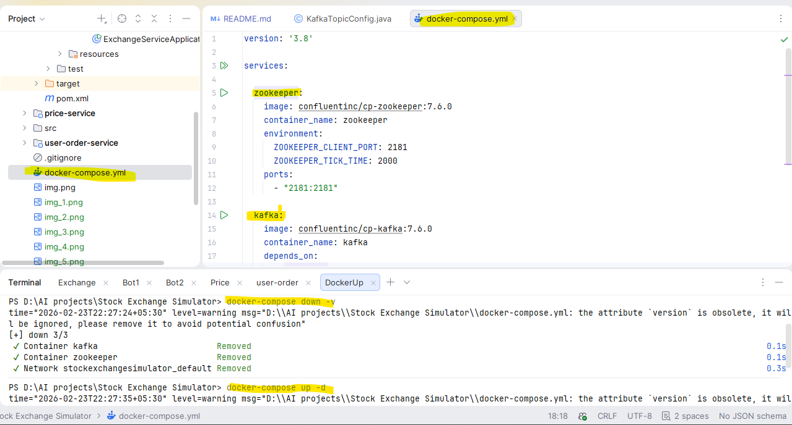
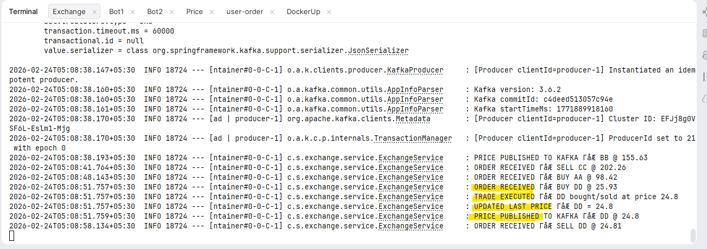
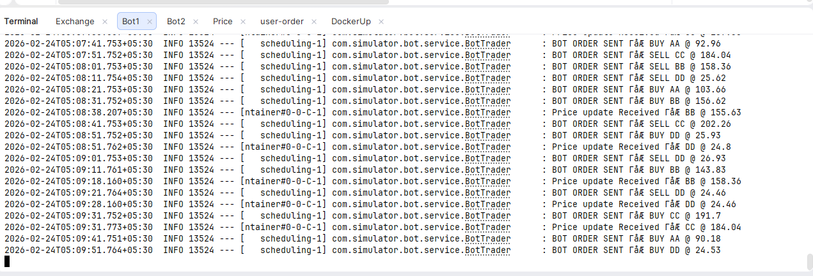
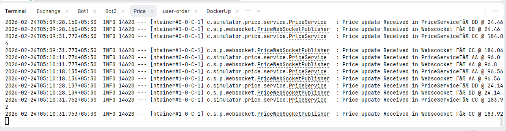
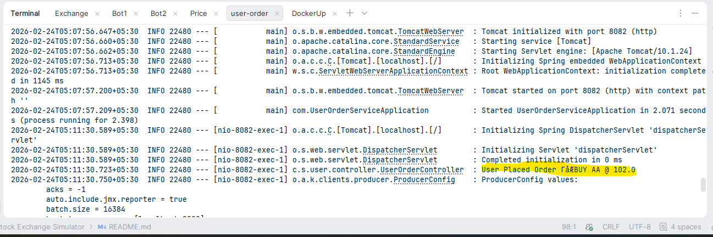
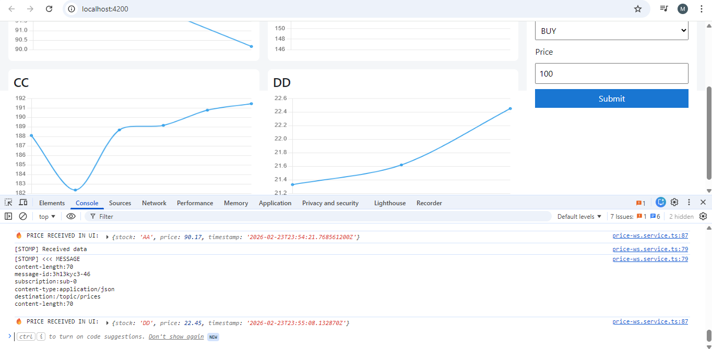

In this project we have implemented a stock exchange simulator.
On this Stock exchange four stocks are tradded. 
The names and starting rates of these stocks are as follows:    
1. AA - 100
2. BB - 150
3. CC - 200
4. DD - 25

There is one stock exchange service running which accepts orders from 4 bot trader services and one user service.
The bot trader services randomly decide to place buy or sell orders for randomly selected stocks at random prices within specified ranges.
The user service allows real users to place buy or sell orders for stocks at specified prices.

This report contains backend implementation details using Java, Spring Boot, and Kafka, as well as frontend implementation using Angular for displaying current stock prices and placing orders.
Frontend repo link : https://github.com/mehul-vaidya/Stock-Exchange-UI

Initial requirements and implementation details:
1.there will be four stocks that will be traded on this exchange. Their names and starting rate will AA-100 , BB-150, CC-200, DD-25
2.there will be 1 stock exchange serivce will be running 
3.there will be total 4 services running which will contantly placing buy/sale order. 
4.One more service will be running which will accept input from real user {stock name , buy or sell, price} 
5.4 services mentioned in point 3 and one user service mentioned in point 4 , will interact with stock exchange serivce mentioned in point 2. stock exchange will take order from them. provide ack. 
6.buy or sell decision will be taken randomly by this 4 services. 
7.which of four stocks need to buy or sell that also will be decided randomly 
8.Buy order will be placed in price randomly selected between range [90% current stock price to current price ] 
9.sell order will be placed in price randomly selected between range (current price to 110% current price) 
10.there will be one more services. stock exhange service will send 
11. 4 services will place order 1 order per 10 second. entire simulator will run for 10 min and end.
12.use java , spring boot rest , kafka for backend.. implement rest services 
13.there will be 2 ui in this . 1 that is mentioned in step 10 to show current prices of four stock. and second that is mentioned in point 4 to place order. 
14.use angular for that.

Most Important question how actual trade happens?
we have 4 stocks in our system AA, BB, CC, DD.
For each stock we maintain two priority queues. one for buy orders and one for sell orders.
Buy orders are sorted in descending order of price (highest price first) and sell orders are sorted in ascending order of price (lowest price first).
When a new order is placed, we check if it can be matched with existing orders in the opposite queue. 
For example, if a buy order is placed for stock AA at price 105, we check the sell queue for AA to see if there are any sell orders with price less than or equal to 105. If there is a sell order at price 100, we match the buy order with that sell order and execute the trade at the price of the sell order (100 in this case). 
If there are multiple sell orders at price 100, we match the buy order with the earliest sell order (first come first serve).
After a trade is executed, we update the current price of the stock to the price at which the trade was executed (100 in this case) and remove the matched orders from their respective queues.

How to run the project:
1.First start docker application on windows then run below comamand
docker-compose down -v
docker-compose up -d

2.start exchange service using below commandas
cd exchange-service
mvn spring-boot:run

3.start bot trader service using below commandas
cd bot-trader-service
mvn clean package

zip file will be created inside target folder
java -jar target\bot-trader-service-1.0-SNAPSHOT.jar --server.port=8085
java -jar target\bot-trader-service-1.0-SNAPSHOT.jar --server.port=8086
java -jar target\bot-trader-service-1.0-SNAPSHOT.jar --server.port=8087
java -jar target\bot-trader-service-1.0-SNAPSHOT.jar --server.port=8088

4.start price service
cd price-service
mvn spring-boot:run

5.start user service
cd user-service
mvn spring-boot:run

6.start frontend. front end is seperate repo. cd inside UI code folder and run below command
ng serve

other useful commands:

to check docker messeages you can use
docker ps
kafka-console-consumer --bootstrap-server localhost:9092 --topic price-topic --from-beginning
enter bash
docker exec -it <copy service name> bash
docker exec -it kafka bash

check price topic messeges
kafka-console-consumer --bootstrap-server localhost:9092 --topic price-topic --from-beginning
kafka-consumer-groups  --bootstrap-server localhost:9092 --describe --group bot-trader-group

Before starting any service , we start docker application

We are running Kafka and zookeeper using docker compose

we use docker compose to start both zookeeper and kafka together

Exchnage service receiving order, maching order and sending price update to price topic

Bot Service placing order and receiving price update from exchange service

Price Service receiving price update from exchange service and sending it to frontend via web socket

User service receiving order from frontend and sending it to exchange service

Remember to check Browser console for any error
