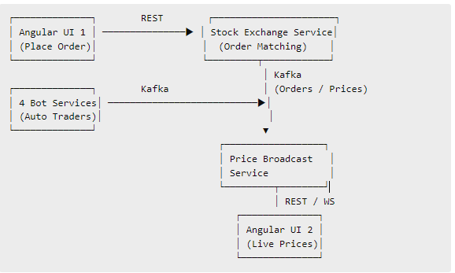

Implement stock exchange simulator which has below requirement 
1.there will be four stocks that will be traded on this exchange. Their names and starting rate will AA-100 , BB-150, CC-200, DD-25
2.there will be 1 stock exchange serivce will be running 
3.there will be total 4 services running which will contantly placing buy/sale order. 
4.One more service will be running which will accept input from real user {stock name , buy or sell, price} 
5.4 services mentioned in point 3 and one user service mentioned in point 4 , will interact with stock exchange serivce mentioned in point 2. stock exchange will take order from them. provide ack. 
6.buy or sell decision will be taken randomly by this 4 services. 
7.which of four stocks need to buy or sell that also will be decided randomly 
8.Buy order will be placed in price randomly selected between range [90% current stock price to current price ] 
9.sell order will be placed in price randomly selected between range (current price to 110% current price) 
10.there will be one more services. stock exhange service will send 
11. 4 services will place order 1 order per 10 second. entire simulator will run for 10 min and end. 

Tech stack 
12.use java , spring boot rest , kafka for backend.. implement rest services 
13.there will be 2 ui in this . 1 that is mentioned in step 10 to show current prices of four stock. and second that is mentioned in point 4 to place order. 
14.use angular for that.

1.First start docker application then run below comamand
docker-compose down -v
docker-compose up -d

2.start exchange service using below commandas
cd exchange-service
mvn spring-boot:run

3.start bot trader service using below commandas
cd bot-trader-service
mvn spring-boot:run

zip file will be created inside target folder
java -jar target\bot-trader-service-1.0-SNAPSHOT.jar --server.port=8085
java -jar target\bot-trader-service-1.0-SNAPSHOT.jar --server.port=8086
java -jar target\bot-trader-service-1.0-SNAPSHOT.jar --server.port=8087
java -jar target\bot-trader-service-1.0-SNAPSHOT.jar --server.port=8088

4.start price service
cd price-service
mvn spring-boot:run

5.start user service
cd user-service
mvn spring-boot:run

to check docker messeages you can use
docker ps
kafka-console-consumer --bootstrap-server localhost:9092 --topic price-topic --from-beginning
enter bash
docker exec -it <copy service name> bash
docker exec -it kafka bash

check price topic messeges
kafka-console-consumer --bootstrap-server localhost:9092 --topic price-topic --from-beginning
kafka-consumer-groups  --bootstrap-server localhost:9092 --describe --group bot-trader-group